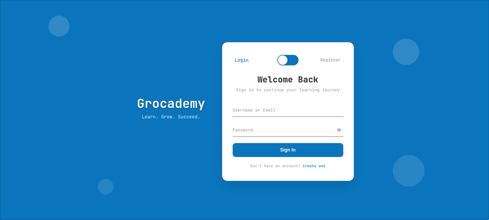
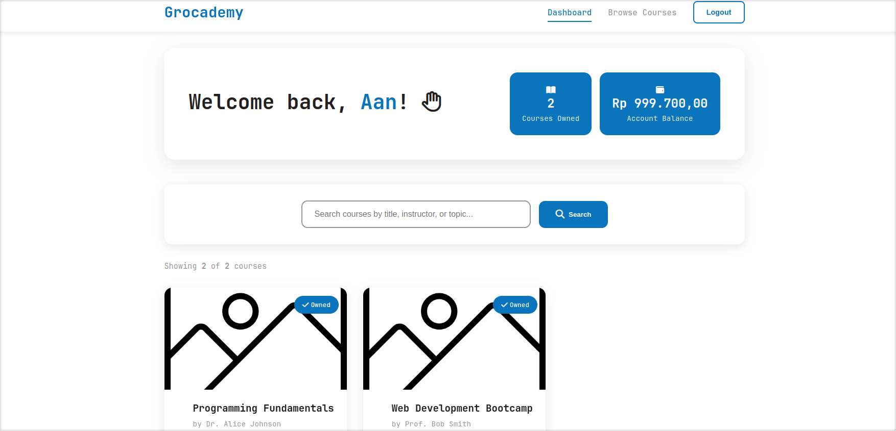
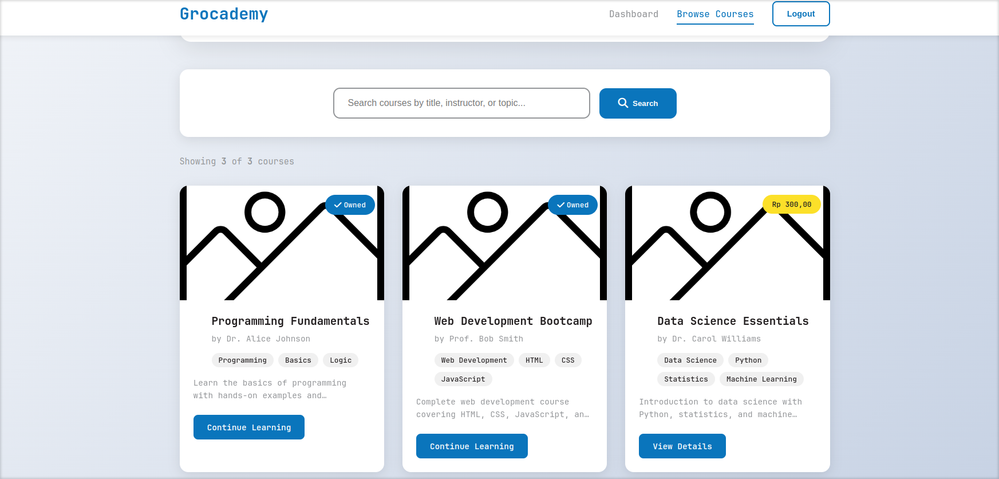
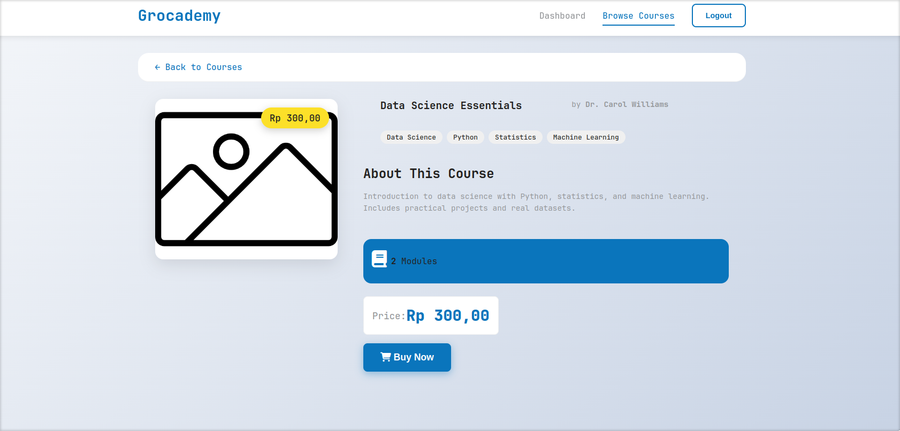
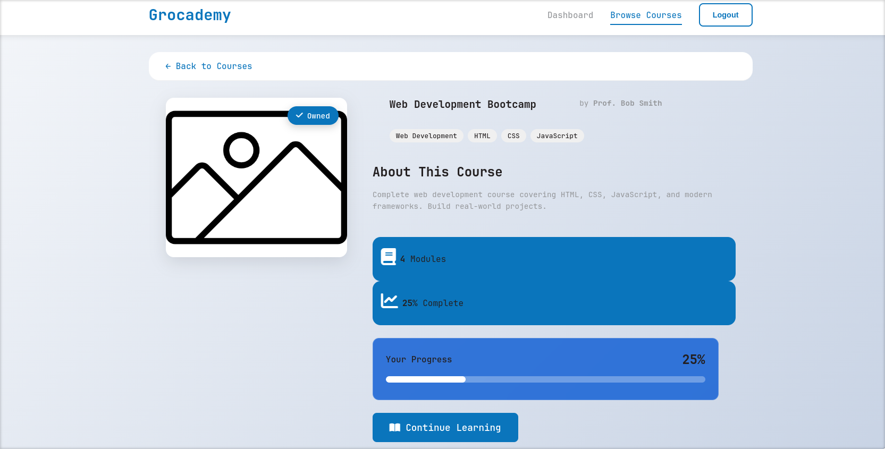
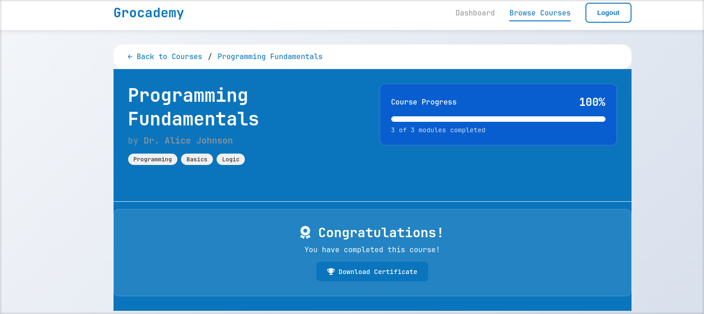

# Grocademy

---

## Identitas
Nama: Rafael Marchel Darma Wijaya

NIM: 13523146

---

## Menjalankan Aplikasi

### Prerequisites
- Docker and Docker Compose
- Java Development Kit (JDK) 21 (for development)
- Git

### Menggunakan Docker
1. Clone repositori
```
git clone
cd grocademy
```

2. Buat .env file dengan template
```
DB_PASSWORD=password-database-mu
JWT_KEY=32charjwtkey
```

3. Build dan Run aplikasi
```
docker compose up -d --build
```

3.1. Jika ada masalah access (Linux)
```
sudo docker compose up -d --build
```

4. Akses localhost:8080
5. Akun admin:
- Username = Fool
- Password = Seer

---

## Design Patterns yang Digunakan
### Model-View-Controller (MVC)

- Alasan: Memisahkan logika bisnis dari tampilan, memungkinkan pengembangan dan maintenance yang lebih mudah. Controller menangani permintaan, Model berisi data dan logika bisnis, dan View menampilkan data.
- Implementasi: Struktur project dengan package controller, entity sebagai model, dan template HTML sebagai view.

### Repository Pattern

- Alasan: Memberikan abstraksi untuk akses data dan operasi database, mempermudah testing dan menghindari duplikasi kode.
- Implementasi: Package repository yang extend JpaRepository untuk setiap entity.

### Builder Pattern

- Alasan: Memudahkan pembuatan entity, menghindari konstruktor yang memiliki parameter berlebihan, pembuatan objeck menjadi immutable
- Implementasi: Setiap entity pada package entity menggunakan inner class Builder untuk pembuatan objek.

### Dependency Injection

- Alasan: Mengurangi coupling antar komponen aplikasi, memudahkan testing, dan mempermudah penggunaan ulang komponen.
- Implementasi: Penggunaan Spring IoC container dan annotation @Autowired untuk injeksi dependency.

### DTO (Data Transfer Object)

- Alasan: Memisahkan representasi data untuk komunikasi API dari entity model dan menghindari eksposur data yang tidak perlu.
- Implementasi: Class DTO pada package dto untuk request dan response API.

---

## Technology Stack
- Backend: Spring Boot 3.2.x (Java 21)
- Database: PostgreSQL 16
- ORM: Spring Data JPA with Hibernate
- Security: Spring Security with JWT Authentication
- File Storage: Local filesystem (uploads directory)
- Migration: Flyway Database Migration
- Containerization: Docker & Docker Compose
- Frontend: Thymeleaf template engine
- Build Tool: Gradle

---

## Endpoint API
### Auth
- POST /api/auth/login - Login user
- POST /api/auth/register - Register new user
- GET /api/auth/self - Get current user info
### Users
- GET /api/users - Get all users (admin)
- GET /api/users/{id} - Get user by ID (admin)
- POST /api/users/{id}/balance - Add balance to user (admin)
- PUT /api/users/{id} - Update user (admin)
- DELETE /api/users/{id} - Delete user (admin)
### Courses
- POST /api/courses - Create course (admin)
- GET /api/courses - Get all courses
- GET /api/courses/{id} - Get course by ID
- PUT /api/courses/{id} - Update course (admin)
- DELETE /api/courses/{id} - Delete course (admin)
- POST /api/courses/{id}/buy - Buy a course
- GET /api/courses/my-courses - Get user's purchased courses
### Modules
- POST /api/courses/{courseId}/modules - Create module (admin)
- GET /api/courses/{courseId}/modules - Get modules for course
- GET /api/modules/{id} - Get module by ID
- PUT /api/modules/{id} - Update module (admin)
- DELETE /api/modules/{id} - Delete module (admin)
- PATCH /api/courses/{courseId}/modules/reorder - Reorder modules (admin)
- PATCH /api/modules/{id}/complete - Mark module as completed
### Web Pages
- / - Home/Landing Page
- /register - Register Page
- /login - Login Page
- /dashboard - User Dashboard
- /courses - Browse Courses
- /courses/{id} - Course Detail
- /courses/{id}/modules - Course Modules
- /logout - Logout

---

## Bonus yang Diimplementasikan
### B08 - SOLID Principles
Aplikasi diimplementasikan dengan mengikuti prinsip SOLID:

#### Single Responsibility Principle
Setiap class memiliki satu tanggung jawab
- Implementasi: Service layer yang memiliki tanggung jawab tunggal

#### Open/Closed Principle
Object dapat dikembangkan fungsionalitasnya tanpa modifikasi
- Implementasi: Interface service memungkinkan implementasi tipe service baru tanpa perlu mengubah kode service yang ada

#### Liskov Substitution Principle
Objek dari kelas turunan dapat menggantikan objek dari kelas dasarnya tanpa mengubah kebenaran program.
- Implementasi: Inheritance dapat menggantikan parent class secara logical

#### Interface Segregation Principle
Penggunaan interface sebagai kontrak behaviour harus atomic. Suatu kelas tidak boleh mengimplementasikan interface yang tidak bisa ia implementasikan secara logic
- Implemetasi: Seluruh objeck client tidak dipaksa bergantung pada method yang tidak digunakan

#### Dependency Inversion Principle
Dependensi pada abstraksi (interface), bukan objek konkrit.
- Implementasi: Seluruh penggunaan service layer menggunakan dependensi terhadap interface-nya

---

## Screenshot








---

## 👤 Author

<p align="center"> <a href="https://github.com/V-Kleio">  <br /> <sub><b>Rafael Marchel Darma Wijaya</b></sub> </a> </p>
<div align="center" style="color:#6A994E;"> 🌿 Crafted with care | 2025 🌿</div>